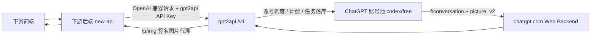

# 下游 new-api / 前端对接开发文档

> 更新时间：2026-04-25（Asia/Shanghai）
> 适用范围：下游自有后端 `new-api` + 下游前端，对接当前 `gpt2api` 图片生成能力。

## 1. 当前结论

- **对外形态**：`gpt2api` 对下游暴露的是 OpenAI 兼容 API，不是 OpenAI 官方 API。
- **推荐 Base URL**：`https://lmage2.dimilinks.com/v1`。
- **认证方式**：`Authorization: Bearer <gpt2api API Key>`；该 Key 只能放在 `new-api` 后端，不能下发到浏览器。
- **当前主要能力**：图片生成；文字 `/v1/chat/completions` 后端保留，但前端入口关闭，不建议新接入时依赖文字能力。
- **当前账号池**：生产库快照为 400 个活跃账号，`account_type=codex`、`plan_type=free`；其中 125 个 `healthy`、275 个 `warned`。
- **当前模型**：`gpt-image-2` 启用，模型配置为 `upstream_model_slug=gpt-5-3`；实际图片链路遇到免费账号 persona 时会自动把上游模型降为 `auto`，由 chatgpt.com 自己选择可用图片模型。
- **当前外置渠道**：`upstream_channels=0`、`channel_model_mappings=0`，所以纯文生图当前也会回落到内置 ChatGPT 账号池，而不是外部 OpenAI/Gemini 渠道。

一句话回答：**是，当前线上账号池是 codex/free 账号；但业务不是走 OpenAI 官方 Codex API，也不是 `cliproxyapi` 那条 CLIProxyAPI 域名，而是 `gpt2api -> chatgpt.com` Web 后端反代路线。**

## 2. 系统边界



### 2.1 哪些事情由 gpt2api 负责

- 校验 `Authorization: Bearer` API Key、IP 白名单、模型白名单。
- 用户积分预扣、成功结算、失败退款。
- 调度 ChatGPT 账号池，一号一任务加锁，失败时跨账号重试。
- 调用 chatgpt.com 的 `f/conversation` 图片链路：`ChatRequirements -> PrepareFConversation -> StreamFConversation -> PollConversationForImages -> ImageDownloadURL`。
- 生成并保存 `image_tasks`，返回 `task_id` 和图片代理 URL。
- 通过 `/p/img/:task_id/:idx?exp=...&sig=...` 代理下载图片，避免下游直接暴露或依赖上游短期直链。

### 2.2 哪些事情由 new-api 负责

- 持有并保护 `gpt2api` API Key，不允许浏览器直接拿到。
- 把下游前端请求转换成 `gpt2api` 支持的 OpenAI 兼容请求。
- 记录下游自己的业务任务 ID 与 `gpt2api.task_id` 的映射。
- 轮询 `gpt2api` 任务状态，并把状态归一化给前端。
- 将 `gpt2api` 返回的相对图片地址补成绝对 URL，或者原样透传并让前端按 `gpt2api` origin 补全。

### 2.3 哪些事情由下游前端负责

- 只调用 `new-api`，不要直接调用 `gpt2api`。
- 展示 `queued / in_progress / succeeded / failed` 等任务状态。
- 渲染图片时保留完整 URL，包括 `exp` 和 `sig` 查询参数。
- 对失败任务展示可读错误，并允许用户重试。

## 3. 对外接口约定

### 3.1 认证

所有 `/v1/*` 请求都必须带：

```http
Authorization: Bearer <gpt2api API Key>
```

注意：`/p/img/*` 图片代理 URL 不需要 API Key，它只依赖 URL 上的 HMAC 签名和过期时间。

### 3.2 获取模型

```http
GET /v1/models
```

响应示例：

```json
{
  "object": "list",
  "data": [
    {
      "id": "gpt-image-2",
      "object": "model",
      "created": 1710000000,
      "owned_by": "chatgpt"
    }
  ]
}
```

前后端对齐建议：下游不要写死所有模型；可以默认用 `gpt-image-2`，但后台配置页或诊断页应能看到 `/v1/models` 返回。

### 3.3 同步图片生成

```http
POST /v1/images/generations
Content-Type: application/json
```

请求示例：

```json
{
  "model": "gpt-image-2",
  "prompt": "A cute orange cat playing with yarn, cinematic lighting",
  "n": 1,
  "size": "1024x1024"
}
```

响应示例：

```json
{
  "created": 1777080000,
  "task_id": "img_3fa25b0cbe914af58b11c27d",
  "data": [
    {
      "url": "/p/img/img_3fa25b0cbe914af58b11c27d/0?exp=1777166400000&sig=xxxx",
      "file_id": "file-service-or-sediment-id"
    }
  ]
}
```

重要约定：

- `prompt` 必填。
- `model` 为空时 gpt2api 默认使用 `gpt-image-2`。
- `n` 默认 `1`，最大按 `4` 处理；`n > 1` 时 gpt2api 会并发启动多个单图任务，可能来自不同 ChatGPT 账号和 conversation。
- `size` 默认 `1024x1024`；`2048` 级和 `3840` 级尺寸会触发本地 2K/4K 代理放大逻辑。
- `response_format=b64_json` 当前不要依赖；当前稳定返回是 `url`。
- 同步请求可能阻塞较久，Nginx 当前读写超时是 600 秒；下游如不想占连接，建议用异步模式。

### 3.4 异步图片生成（推荐给 new-api）

三种方式任选一种：

```http
POST /v1/images/generations?async=true
POST /v1/images/generations?wait_for_result=false
POST /v1/images/generations
Prefer: respond-async
```

也可以在 JSON body 里传：

```json
{
  "model": "gpt-image-2",
  "prompt": "A poster of a futuristic city",
  "n": 1,
  "size": "1024x1024",
  "wait_for_result": false
}
```

提交响应固定是 HTTP `200`，不是 `202`：

```json
{
  "created": 1777080000,
  "task_id": "img_0af0fe5de388490597197ee8",
  "data": []
}
```

为什么不是 `202`：部分下游网关会把上游 `202` 当错误处理，所以当前 gpt2api 为兼容下游固定返回 `200`。如果 `new-api` 想对自己的前端返回 `202`，那是 `new-api` 自己的协议，不应反向要求 gpt2api 返回 `202`。

### 3.5 查询异步任务（推荐路径）

```http
GET /v1/tasks/{task_id}
```

进行中响应示例：

```json
{
  "id": "img_0af0fe5de388490597197ee8",
  "task_id": "img_0af0fe5de388490597197ee8",
  "object": "image.task",
  "status": "in_progress",
  "progress": 50,
  "created_at": 1777080000
}
```

成功响应示例：

```json
{
  "id": "img_0af0fe5de388490597197ee8",
  "task_id": "img_0af0fe5de388490597197ee8",
  "object": "image.task",
  "status": "succeeded",
  "progress": 100,
  "created_at": 1777080000,
  "completed_at": 1777080040,
  "result": {
    "created": 1777080000,
    "data": [
      {
        "url": "/p/img/img_0af0fe5de388490597197ee8/0?exp=1777166400000&sig=xxxx",
        "file_id": "file-service-or-sediment-id"
      }
    ]
  }
}
```

失败响应示例：

```json
{
  "id": "img_0af0fe5de388490597197ee8",
  "task_id": "img_0af0fe5de388490597197ee8",
  "object": "image.task",
  "status": "failed",
  "progress": 100,
  "created_at": 1777080000,
  "completed_at": 1777080300,
  "error": {
    "code": "poll_timeout",
    "message": "上游生成超时,已自动换号重试;请稍后再试"
  }
}
```

状态映射：

| gpt2api 内部状态 | `/v1/tasks` 状态 | 前端建议 |
| --- | --- | --- |
| `queued` / `dispatched` | `queued` | 展示排队中，继续轮询 |
| `running` | `in_progress` | 展示生成中，继续轮询 |
| `success` | `succeeded` | 展示图片 |
| `failed` | `failed` | 展示错误和重试入口 |

兼容路径：`GET /v1/images/tasks/{task_id}` 仍存在，但它返回的是历史结构；新接入建议统一用 `/v1/tasks/{task_id}`。

### 3.6 图生图 / 参考图

JSON 路径支持非标准扩展字段：

```json
{
  "model": "gpt-image-2",
  "prompt": "把参考图改成赛博朋克风格",
  "reference_images": [
    "https://example.com/input.png",
    "data:image/png;base64,...."
  ]
}
```

兼容别名：`images`、`image`、`image_url`、`image_urls`、`input_image`、`input_images`。

限制：

- 同一次请求最多 4 张参考图。
- 单张参考图最大 20MB。
- 参考图可以是 HTTPS URL、data URL 或纯 base64。
- 带参考图时 gpt2api 当前会减少跨账号重试，避免重复上传导致上游上下文不一致。

### 3.7 OpenAI 风格图片编辑

```http
POST /v1/images/edits
Content-Type: multipart/form-data
```

字段：

- `model`：默认 `gpt-image-2`。
- `prompt`：必填。
- `n`：默认 `1`，最大 `4`。
- `size`：默认 `1024x1024`。
- `upscale`：可选，`2k` 或 `4k`。
- `image` / `image[]` / `images` / `images[]`：至少一张图片文件。

内部实际仍走 ChatGPT 账号池的参考图上传 + 图片生成链路。

## 4. 图片 URL 处理

gpt2api 账号池路线返回的图片 URL 通常是相对路径：

```text
/p/img/{task_id}/{idx}?exp={unix_ms}&sig={hmac}
```

new-api 有两种处理方式：

1. **推荐**：在后端补成绝对地址后再给前端。

```ts
const GPT2API_ORIGIN = 'https://lmage2.dimilinks.com'
const absoluteUrl = new URL(item.url, GPT2API_ORIGIN).toString()
```

2. 原样透传相对路径，但前端必须知道它属于 `gpt2api` origin，而不是 `new-api` origin。

注意：

- 不要丢掉 `exp` 和 `sig`。
- 签名 URL 默认有效期约 24 小时。
- gpt2api 进程重启后，旧签名 URL 会失效；如果前端历史图裂了，应让后端重新查询任务拿新 URL，而不是复用旧 URL。
- `/p/img` 第一次访问会回源到 chatgpt.com 换取短期下载链接；开启 2K/4K 时还会在本进程做一次 CPU 放大并缓存。

## 5. new-api 推荐实现

### 5.1 提交任务

```ts
async function submitImageTask(input: {
  prompt: string
  model?: string
  n?: number
  size?: string
  reference_images?: string[]
}) {
  const res = await fetch('https://lmage2.dimilinks.com/v1/images/generations?async=true', {
    method: 'POST',
    headers: {
      'Authorization': `Bearer ${process.env.GPT2API_KEY}`,
      'Content-Type': 'application/json',
    },
    body: JSON.stringify({
      model: input.model || 'gpt-image-2',
      prompt: input.prompt,
      n: input.n || 1,
      size: input.size || '1024x1024',
      reference_images: input.reference_images,
    }),
  })

  const body = await res.json()
  if (!res.ok) throw new Error(body?.error?.message || 'gpt2api submit failed')
  return body.task_id as string
}
```

### 5.2 轮询任务

```ts
async function getImageTask(taskId: string) {
  const res = await fetch(`https://lmage2.dimilinks.com/v1/tasks/${taskId}`, {
    headers: {
      'Authorization': `Bearer ${process.env.GPT2API_KEY}`,
    },
  })
  const body = await res.json()
  if (!res.ok) throw new Error(body?.error?.message || 'gpt2api task query failed')

  if (body.status === 'succeeded') {
    body.result.data = body.result.data.map((item: { url: string }) => ({
      ...item,
      url: new URL(item.url, 'https://lmage2.dimilinks.com').toString(),
    }))
  }
  return body
}
```

### 5.3 轮询策略

- 首次提交后 1 秒开始轮询。
- 常规间隔 2 到 5 秒。
- 文生图建议最多等 6 分钟。
- 图生图 / 编辑建议最多等 15 分钟。
- 如果 `status=failed`，停止轮询，记录 `error.code` 和 `error.message`。

## 6. 前端对齐点

- 前端任务状态以 `new-api` 返回为准，不直接理解 gpt2api 内部状态。
- 只要 `status` 是 `queued` 或 `in_progress`，就保持 loading，不要当失败。
- 成功后优先展示 `result.data[].url`。
- 图片 URL 可能是 `https://...`、`data:image/...` 或 `/p/img/...`；前端渲染层要兼容三种形式。
- 如果后端没有补绝对 URL，前端必须用 `https://lmage2.dimilinks.com` 补齐 `/p/img/...`。
- 不要把 `file_id` 当成可下载 URL；它只是排查和对账字段。

## 7. 常见错误码

| HTTP / 任务状态 | code | 含义 | 下游建议 |
| --- | --- | --- | --- |
| 401 | `missing_api_key` / `invalid_api_key` | gpt2api API Key 缺失或错误 | 检查 new-api 环境变量 |
| 403 | `model_not_allowed` | Key 没有模型权限 | 检查 gpt2api Key 模型白名单 |
| 400 | `model_not_found` | 模型不存在或下架 | 使用 `/v1/models` 校验 |
| 400 | `invalid_request_error` | 参数错误 | 前端/后端参数校验 |
| 402 | `insufficient_balance` | gpt2api 用户积分不足 | 充值或调整计费 |
| 429 | `rate_limit_rpm` | API Key RPM 超限 | 降低并发或提高限额 |
| 503 | `no_available_account` | 当前没有可调度账号 | 后端排队/稍后重试 |
| 503 | `rate_limited` | 上游账号限流 | 稍后重试，观察账号池 |
| 502 / failed | `poll_timeout` | 上游生成后轮询超时 | 可提示用户重试 |
| 502 / failed | `download_failed` | 图片下载签名或回源失败 | 重新查任务或重试 |
| 502 / failed | `upstream_error` | chatgpt.com 上游异常 | 记录 trace，稍后重试 |

## 8. 排查清单

### 8.1 new-api 后端先查

- 请求是否打到 `https://lmage2.dimilinks.com/v1`，不是 `https://cliproxyapi.845817074.xyz`。
- 是否带了 `Authorization: Bearer <gpt2api API Key>`。
- 异步提交是否按 HTTP `200` + `task_id` 处理，而不是强依赖 HTTP `202`。
- 是否轮询 `/v1/tasks/{task_id}`，而不是只等提交接口最终出图。
- 是否把 `/p/img/...` 补成绝对 URL，并保留 `exp` / `sig`。

### 8.2 下游前端先查

- loading 状态是否覆盖 `queued` 和 `in_progress`。
- 图片 src 是否是完整 URL，或者能正确基于 gpt2api origin 补全。
- 是否误把 `file_id` 当图片 URL。
- 是否因为浏览器访问的是 new-api 域名，导致相对 `/p/img` 被请求到 new-api 而不是 gpt2api。

### 8.3 gpt2api 运维侧先查

```bash
docker compose -f deploy/docker-compose.yml ps
curl -fsS http://127.0.0.1:8080/healthz
docker logs --tail=200 gpt2api-server
```

重点日志关键词：

- `image runner SSE parsed`
- `image runner poll done`
- `image runner parallel retry with another account`
- `poll_timeout`
- `turnstile required`
- `no_available_account`

## 9. 不要混淆的两条域名

- `https://lmage2.dimilinks.com`：当前 `gpt2api`，给下游 `new-api` 接图片 API。
- `https://cliproxyapi.845817074.xyz`：CLIProxyAPI，不是这次图片 API 的 gpt2api 入口。

## 10. 双方验收标准

后端验收：

- `POST /v1/images/generations?async=true` 能拿到 `task_id`。
- `GET /v1/tasks/{task_id}` 能从 `queued/in_progress` 变成 `succeeded` 或 `failed`。
- 成功时返回给前端的是可直接访问的图片 URL。
- 失败时返回给前端的是稳定错误码和可读文案。

前端验收：

- 提交后能显示生成中，不会把 `200 + data: [] + task_id` 当空结果。
- 成功后能展示图片，刷新后能重新从后端拿任务状态和图片 URL。
- 失败后能展示错误，并允许用户重新提交。
- 不暴露 `gpt2api` API Key。
